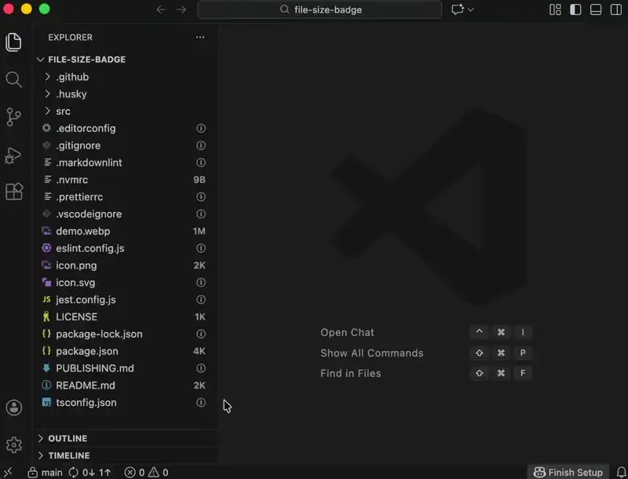

# File Size Badge

Displays file sizes as badges in the file explorer and shows the active file size in the status bar. Also displays Lines of Code (LOC) information in tooltips and status bar.

Compatible with VS Code and Cursor.

## Features

- Shows file sizes as badges next to files in the explorer
- Hover over files to see human-readable file sizes and LOC information in tooltips
- Displays the size and LOC of the currently active file in the status bar
- Configurable LOC display in tooltips and status bar

## Notes

The ⓘ symbol is displayed when file sizes cannot be represented in exactly 2 characters (the limitation of IDE badges). In these cases, hover over the file to see the full human-readable file size in the tooltip.

## Configuration

### `fileSizeBadge.excludedDirectories`

Array of directory names to exclude from file size tracking. This improves performance by reducing unnecessary file system operations.

**Default:** `[".git", "build", "dist", "node_modules"]`

You can customize this list in your IDE settings to exclude additional directories specific to your project.

### `fileSizeBadge.loc.showInTooltips`

Show Lines of Code (LOC) information in tooltips. When enabled, displays `"X lines (Y loc) • Z KB"` format. When disabled, shows only the file size.

**Default:** `true`

### `fileSizeBadge.loc.showInStatusBar`

Show Lines of Code (LOC) information in the status bar item. When enabled, displays `"X lines (Y loc) • Z KB"` format. When disabled, shows only the file size.

**Default:** `true`

### `fileSizeBadge.statusBar.alignment`

Alignment of the status bar item. Choose `"Left"` to place it on the left side of the status bar, or `"Right"` to place it on the right side.

**Default:** `"Left"`

### `fileSizeBadge.statusBar.priority`

Priority for the status bar item. Lower numbers appear more to the left. Leave empty to let IDE decide the priority automatically.

**Default:** `null`

## License

MIT
